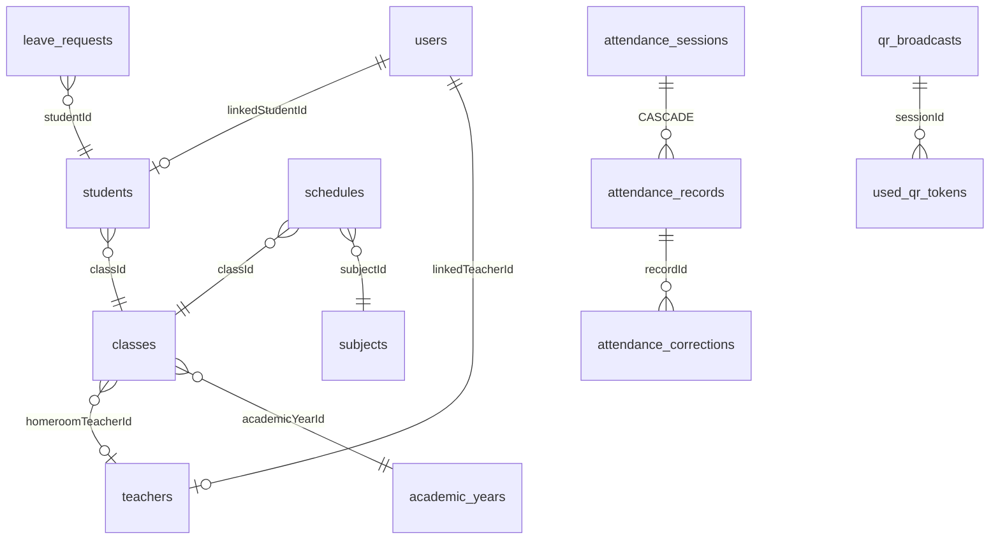

# SiAbsen 📱


**Aplikasi absensi sekolah offline-first** dengan Kotlin + Jetpack Compose. Semua data tersimpan lokal di device (Room), tanpa server — cocok untuk sekolah yang tidak punya infrastruktur backend.

> 📥 **Download APK terbaru**: [Releases → SiAbsen-latest.apk](https://github.com/az925-crypto/Siabsen-/releases/latest)

---

## ✨ Fitur

### Multi-role
| Role | Kemampuan |
|---|---|
| 👨‍🎓 **Siswa** | Check-in/out mandiri, scan QR, riwayat kalender, jadwal pelajaran, statistik, ajukan izin/sakit + lampiran |
| 👨‍🏫 **Guru** | Absen kelas manual, sesi QR dinamis, absensi per mapel, verifikasi izin, rekap, laporan CSV/PDF, koreksi absensi |
| 👔 **Wali Kelas** | Semua fitur guru + halaman Early Warning siswa berisiko |
| 🛠️ **Admin** | Master data (siswa/guru/kelas/mapel/tahun ajaran/kalender), pengumuman, pengaturan sekolah, import CSV, backup/restore, audit log |

### Keamanan & Anti-Fraud
- 🔐 PIN di-hash **PBKDF2-HMAC-SHA256** (60k iterasi + salt acak per user)
- 🧬 App lock PIN + **biometrik**, auto-lock setelah N menit di background
- 📡 **QR dinamis**: token HMAC-SHA256 berganti tiap 30 detik, expired 15 menit, *one-time use* per siswa (anti foto-ulang & replay)
- 📍 Validasi opsional: radius GPS sekolah, Wi-Fi SSID sekolah, **device binding** (1 akun siswa = 1 HP)
- 👮 Koreksi ALPA→Hadir menuntut **PIN wali kelas/admin**
- 🧾 **Audit log** semua aktivitas sensitif (login, koreksi, keputusan izin, backup/restore)

### Lain-lain
- ⏰ Status otomatis dari jam masuk: Hadir / Terlambat / ditolak jika lewat window
- 📊 Statistik mingguan-bulanan-semester, insight tren naik/turun, hari telat tertinggi
- 🚨 Early warning threshold dapat diatur admin
- 🔔 Notifikasi lokal: reminder belum absen, kelas belum diabsen, keputusan izin
- 💾 Backup/restore JSON (replace/merge + integrity check), export CSV & PDF
- 🏫 Kalender sekolah (libur/ujian/kegiatan tidak dihitung alpa), tahun ajaran multi-semester
- 📢 Pengumuman sekolah, logo sekolah, pencarian global multi-tipe

---

## 🛠️ Teknologi

| Layer | Tech |
|---|---|
| UI | Jetpack Compose + Material 3 (dynamic color) |
| Architecture | MVVM + Repository, single-activity, Navigation Compose |
| DI | Hilt (+ hilt-work untuk Worker) |
| Database | Room v2 *(destructive migration — lihat catatan dev)* |
| Preferences | DataStore Preferences (+ key-value generik) |
| Background | WorkManager (reminder periodik per jam) |
| QR | ZXing core (generate bitmap) + zxing-android-embedded (scan via `ScanContract`) |
| Crypto | `javax.crypto` PBKDF2 + HmacSHA256 |
| Serialisasi | kotlinx-serialization (backup JSON) |
| PDF | `android.graphics.pdf.PdfDocument` (tanpa lib eksternal) |

**Requirement build:** JDK 17 · Android SDK 35 · AGP 8.7.3 · Gradle 8.10.2

---

## 🚀 Mulai Cepat

### Build via GitHub Actions (tanpa setup apa pun)
Push ke `main` → tab **Actions** jalan otomatis → APK signed terbit di [Releases](https://github.com/az925-crypto/Siabsen-/releases/latest).

### Build lokal
```bash
git clone https://github.com/az925-crypto/Siabsen-.git
cd Siabsen-
./gradlew :app:assembleDebug
# APK: app/build/outputs/apk/debug/app-debug.apk
```

### Akun demo (seed otomatis saat pertama jalan)
| Username | Role | PIN |
|---|---|---|
| `admin` | Admin | `123456` |
| `guru` | Guru (Budi Santoso) | `123456` |
| `wali` | Wali Kelas (Sari Wulandari) | `123456` |
| `siswa` | Siswa (Andi Wijaya, XII IPA 1) | `123456` |

Seed juga membuat 30 hari riwayat absensi acak supaya statistik langsung kelihatan.

---

## 🏗️ Arsitektur

```
UI (Compose, per-role bottom nav)
        │  StateFlow / collectAsState
ViewModels (@HiltViewModel)
        │  suspend + Flow
Repositories (logika bisnis)
        │                    │
Room (siabsen.db)      DataStore (settings)
```

Aturan alur:
- **Tulis** = suspend fun repository → DAO
- **Baca reactive** = `Flow` dari DAO → `stateIn(viewModelScope)` → UI collect
- ViewModel tidak pernah menyentuh DAO secara langsung (kecuali audit/pengumuman yang read-only sederhana)

### Struktur folder

```
app/src/main/java/zaaaam/siabsen/com/
├── data/
│   ├── local/
│   │   ├── entity/          # 16 tabel Room (semua @Serializable utk backup)
│   │   ├── dao/             # RosterDao, AttendanceDao, AcademicDao, dll
│   │   └── SiabsenDatabase.kt
│   ├── repository/          # Auth, Roster, Attendance, Leave, Academic,
│   │                        # Settings (DataStore), Export, Backup
│   ├── backup/              # BackupFile schema JSON + codec
│   ├── export/              # CSV builder + PDF renderer
│   └── seed/DemoSeeder.kt   # data demo idempoten
├── security/                # PinHasher, SessionManager, AuditLogger
├── qr/                      # QrCodec (HMAC), QrImage (bitmap)
├── notification/            # Notifier + CrashReporter (crash-latest.txt)
├── work/                    # ReminderWorker (per jam, 06–17)
├── di/AppModule.kt          # provider DB + semua DAO
└── ui/
    ├── navigation/          # Routes + RootNavHost (bottom bar per role)
    ├── theme/               # Color, Shapes, Typography
    ├── components/          # StatusChip, StatCard, Avatar, EmptyState, ...
    └── feature/
        ├── auth/            # Login (pilih akun + PIN)
        ├── lock/            # AppLockScreen (PIN/biometrik)
        ├── student/         # Home, ScanQR, Riwayat kalender, Jadwal,
        │                    # Statistik, Pengajuan Izin
        ├── guru/            # Dashboard, Kelas, AmbilAbsensi(+per mapel),
        │                    # QR Broadcast, Verifikasi Izin, Rekap,
        │                    # Laporan, Early Warning
        ├── admin/           # Dashboard, master data ×5, kalender,
        │                    # pengaturan, backup, audit, pengumuman
        └── shared/          # Akun (ganti PIN/logout), Pencarian, Profil siswa
```

### Skema database (ringkas)



Entitas lengkap: `users, students, teachers, classes, subjects, academic_years, school_calendar, schedules, attendance_sessions, attendance_records, attendance_corrections, leave_requests, audit_logs, announcements, qr_broadcasts, used_qr_tokens`

> **Prinsip penting**: attendance tidak pernah disimpan sebagai `student.status`. Selalu melalui **Session → Record → Student** sehingga mendukung absensi harian maupun per mata pelajaran tanpa mengubah struktur.

---

## 🔐 Protokol QR

```
Payload QR  : SIABSEN1|<sessionId>|<window>|<token32hex>
window      : epochSeconds / rotationSeconds (default 30)
token       : HMAC_SHA256(secret, "<sessionId>|<window>")[0..15] hex
secret      : 24 byte acak per broadcast, hanya ada di HP guru
validasi    : window saat ini ATAU sebelumnya diterima (toleransi scan)
one-time    : (sessionId, studentId, token) unik di tabel used_qr_tokens
expired     : broadcast.expiresAt (default now + 15 menit)
```

Alasan desain: guru tidak butuh internet; QR statis mudah difoto-disebarkan; token bekas tak bisa dipakai ulang siswa lain/kemudian hari.

---

## ⚙️ Pengaturan (DataStore)

Semua di menu Admin → Pengaturan. Disimpan via `SettingsRepository`:

| Grup | Key penting | Default |
|---|---|---|
| Jam absensi | checkInStart / onTimeUntil / lateUntil / checkOutFrom | 05:30 / 06:45 / 07:30 / 15:00 |
| Hari sekolah | schoolDays (1=Sen..7=Min) | Sen–Jum |
| QR | qrEnabled, qrRotationSeconds, qrValidityMinutes | on / 30 / 15 |
| Lokasi | locationCheckEnabled, schoolLatitude/Longitude, radiusMeters | off / 0,0 / 150 m |
| Wi-Fi | wifiCheckEnabled, wifiSsid | off / "" |
| Keamanan | appLockEnabled, biometricEnabled, autoLockMinutes, deviceBindingEnabled | off/on/5/off |
| Early warning | warnThresholdPercent, criticalThresholdPercent | 90 / 80 |

DataStore juga dipakai sebagai KV store generik (`kvGet/kvPut`) untuk: device binding (`bind_<nis>`), dedup notifikasi harian (`notified_class_<tid>_<epochDay>`).

---

## 🧑‍💻 Panduan Berkontribusi

### Menambah entitas baru
1. Buat `@Entity` + `@Serializable` di `data/local/entity/` (serializable agar ikut backup).
2. Buat DAO di `data/local/dao/`.
3. Daftarkan entity + abstract fun di `SiabsenDatabase`, **naikkan `version`**.
4. Tambahkan `@Provides` DAO di `di/AppModule.kt`.
5. Jika ikut dibackup: tambah field di `BackupFile`, query/insert/clear di `BackupDao`, wiring di `BackupRepository`.
6. ⚠️ Migrasi bersifat **destruktif** (data user terhapus & seed ulang). Untuk rilis stabil, ganti ke migrasi eksplisit.

### Konvensi kode
- Identifier Inggris, string UI **Indonesia** (hardcoded — i18n menyusul).
- Warna status selalu lewat `statusColor(status)` / `StatusChip`.
- Layar baru = fungsi `@Composable` + VM `@HiltViewModel` di folder fiturnya; daftarkan route di `Routes.kt` + `RootNavHost`.
- Operasi user-facing (backup, import, restore) **wajib** try-catch dan memberi pesan, bukan crash.

### Debugging
- Crash? Buka `Android/data/zaaaam.siabsen.com/files/crash-latest.txt` (CrashReporter menulis stacktrace semua uncaught exception).
- Logcat via PC:
  ```bash
  adb logcat --pid=$(adb shell pidof -s zaaaam.siabsen.com)
  ```

### Ide kontribusi (good first issue)
- [ ] Unit test PinHasher & QrCodec (pure JVM, mudah)
- [ ] Migrasi Room eksplisit menggantikan destructive
- [ ] i18n strings.xml
- [ ] Compose UI test untuk alur login

---

## 🗺️ Roadmap

| Versi | Isi | Status |
|---|---|---|
| MVP+V1+V2 | Semua fitur di atas | ✅ |
| V3 | Offline-sync multi-device, cloud backend, QR lintas-HP, akun orang tua, web dashboard | ❌ butuh server |

---

## 🤝 Kontribusi

Fork → branch (`feat/nama-fitur`) → commit → PR. Pastikan CI hijau sebelum review.

## 📄 Lisensi

Belum ditentukan — hubungi maintainer sebelum menggunakan produksional.
